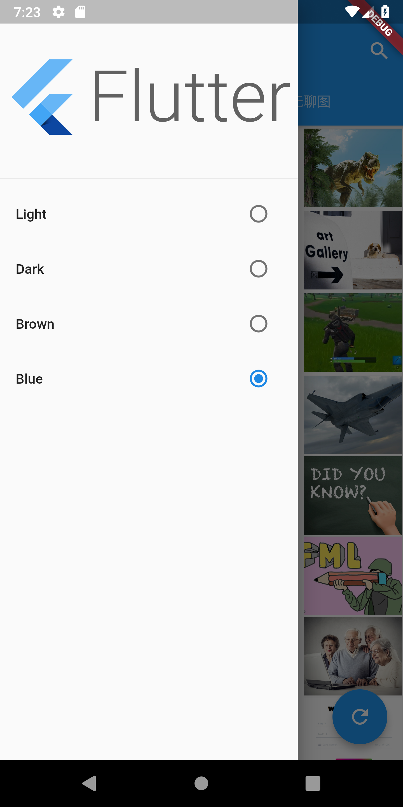
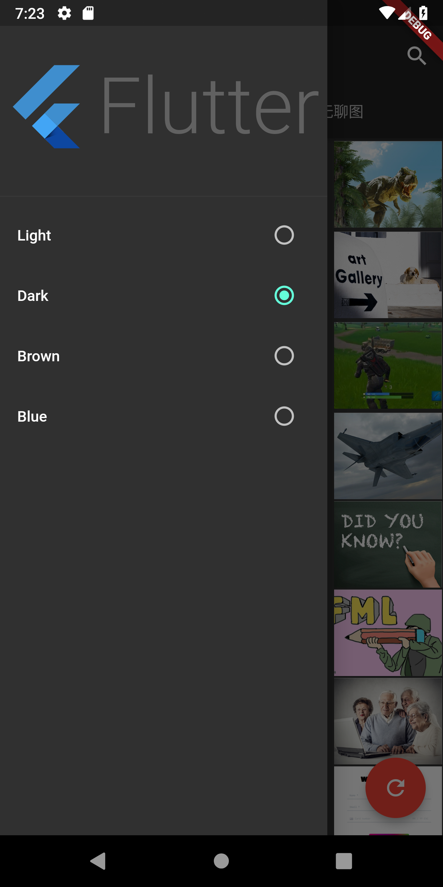
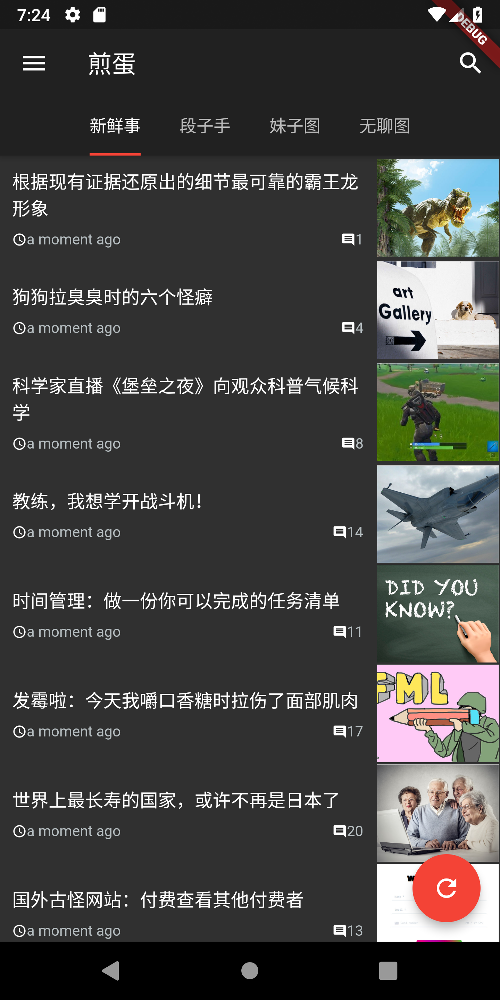
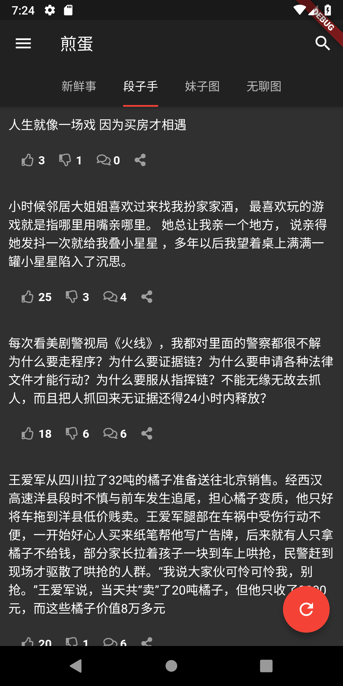
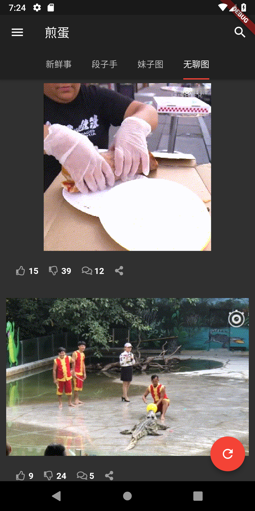

# FlutterJanDan
- 基于Flutter的高仿 煎蛋 的第三方客户端
- [关于Google Flutter](https://flutterchina.club/)

# 功能
- [x] 新鲜事、段子、妹子图、无聊图
- [x] 主题切换
- [ ] 新鲜事详情页暂时用web预览，后面改为自定义详情页
- [ ] 搜索功能暂未实现
- [ ] 无聊图的Gif图将自动播放改为点击预览暂未实现
- [ ] 操作区的点赞和评论详情(点击下拉查看)、分享暂未实现

# TODO:
- 页面优化，细节优化，简化代码和结构。

# 截图
### Android

    
    
    

    
    
    

# LICENSE
@Apache License 2.0
